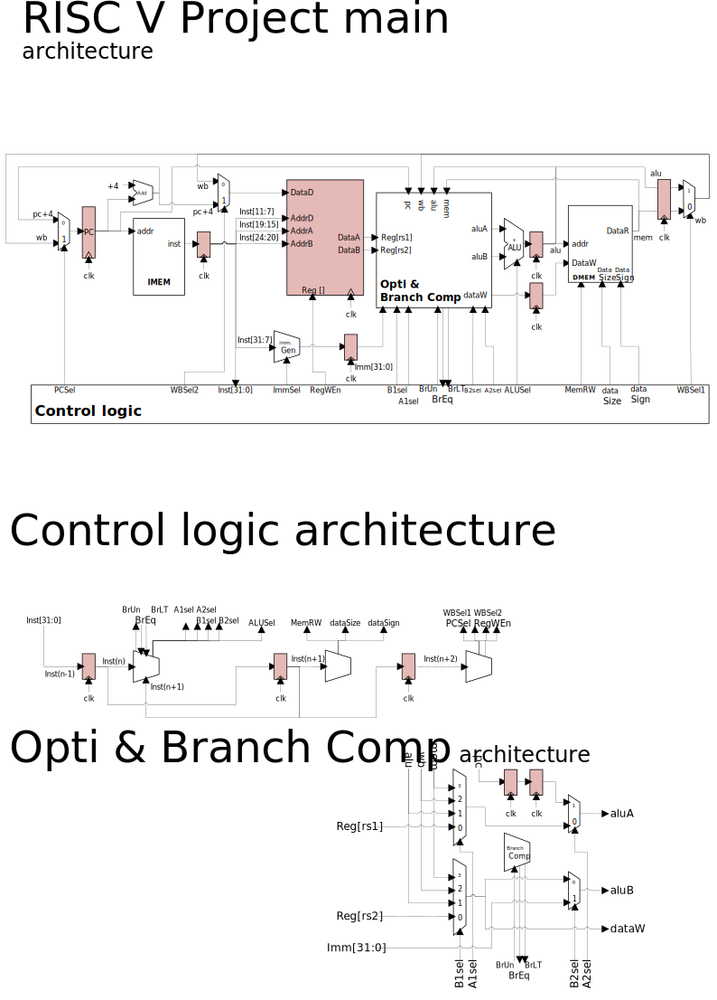

# RISC_V_PROJECT
**SEI 2A project semester 8 with personnal improvements**

This 4th year engineering school project involved building a 32-bit *RISC-V* processor in System Verilog. The processor had to be capable of executing the *RV32I* instruction set without extensions. The processor is also accompanied by a compiler that can be used to convert *RV32I* assembly code into machine code.

## Architecture
The processor adopts *Harvard*. It features a 5-stage pipeline (Fetch, Decode, Execute, Memory, WriteBack). It is capable of executing the entire *RV32I* instruction set without extensions, with the exception of the following instructions:
- `csrrw`
- `csrrs`
- `csrrc`
- `csrrwi`
- `csrrsi`
- `csrrci`
- `ecall`
- `ebreak`
- `fence`
- `fence.i`

## Folder description
- **asic** : Contains the elements needed to summarise the processor
- **bench** : Contains the processor test benches. Test progress can be found in the  [TODO.md](bench/TODO.md) file
- **compilateur** : Contains the compiler sub-project described in the  [Compilateur RV32I](#compilateur-rv32i) section
- **config** : Contains configuration files for ModelSim synthesis tools
- **doc** : Contains all the project documentation
- **prog** : Contains the processor test programs. The description of each program can be found in the [description_tests.md](prog/description_tests.md) file
- **rtl** : Contains the processor source code
- **winconfig** : Contains the configuration files for ModelSim under Windows

## Usage
To simulate the processor under Windows with ModelSim and with the main bench, simply run the [`rtl/wincompile_System_Verilog.bat.bat`](rtl/wincompile_System_Verilog.bat) script, which will launch ModelSim and run the testbench `bench/bench_riscv.sv`. You can change the testbench to be run by modifying the script file as follows:
- On line **6** define the path to the folder containing the project
    ```batch
    set PROJECT_PATH=Chemin/vers/le/dossier/contenant/le/projet
    ```
- On line **14**, define the RTL files to be compiled
    ```batch
    set RTL_FILE[0]=fichier1.sv
    set RTL_FILE[1]=fichier2.sv
    ...
    ```
    > **Note:** It is possible to compile all RTL files at the same time as follows
    > ```batch
    > set RTL_FILE[0]=*.sv
    > ```
- On line **17** define the testbench to be compiled
    ```batch
    set BENCH_FILE[0]=fichier1.sv
    set BENCH_FILE[1]=fichier2.sv
    ...
    ```
    > **Note:** It is also possible to compile all RTL files at the same time as follows
    > ```batch
    > set BENCH_FILE[0]=*.sv
    > ```
- **Important:** The number of files to be compiled must be changed on lines **59** and **60**
    ```batch
    for /l %%i in (0,1,NB_FICHIER) do call :display "!RTL_FILE[%%i]!"  %RTL_PATH%
    for /l %%i in (0,1,NB_FICHIER) do call :display "!BENCH_FILE[%%i]!" %BENCH_PATH%
    ```
- On line **66** define the testbench to be run and the bench start script to be run
    ```batch
    vsim -voptargs=+acc -do "do {%PROJECT_PATH%/%BENCH_PATH%/SCRIPT DE DEBUT DE BENCH}" LIB_Miniproj_RISCV.BENCH_A_EXECUTER
    ```
    > **Note:** Put the name of the testbench module to be executed in place of `BENCH_A_EXECUTER` and not the name of the file

## Advancement
Most of the instructions are functional. However, there are still a number of problems preventing the main test program from running. This validates :
- [x]  Writing in registers
- [x]  Reading the registers
- [x]  Writing in memory
- [x]  Arithmetic operations

## RV32I Compiler
In order to carry out our testbench, we needed to create a compiler that would allow us to convert *RV32I* assembly code into machine code. To do this, we reused the compiler we created during the computer science project in semester 7.

### Usage
To compile an assembler file, simply use the following syntax:
```
rv32icomp.exe source_file regexps_file binfile [-v] [-c] [-s mem_size]
```
| Syntax | Description |
|---------------|--------------------|
| `source_file` | Source code to read |
| `regexps_file` | File containing the desired syntax (we recommend using the  `database.txt` file) |
| `binfile` | Name of the binary file to be generated |
| `-v` | Displays parsing progress |
| `-c` | Displays compiled code |
| `-s` | Simulates compiled code and displays tests |
| `mem_size` | Size of memory to be simulated |

### Fonctionnalités
The compiler is able to compile the entire *RV32I* instruction set without extensions, with the exception of the following instructions:
- `csrrw`
- `csrrs`
- `csrrc`
- `csrrwi`
- `csrrsi`
- `csrrci`
- `ecall`
- `ebreak`
- `fence`
- `fence.i`

The compiler is able to compile the following instructions which are not supported by the target processor :
- `j` replaced by `jal r6,offset`
- `li` replaced by `addi rd,zero,imm`
- `mv` replaced by `add rd,rs1,zero`
- `ble` replaced by `add` and `blt`

The compiler also automatically adds two `NOP` instructions after each branch instruction.

Finally, it automatically loops the programme back on itself at the end of the source code.

### Compiling
It is possible to compile an executable under Windows via **MinGW** by running `wincompile.bat` or under Linux via *WSL* by running `compile.bat`.
Both scripts generate an executable named `rv32icomp.exe` in the `bin` directory, and run it with test code under valgrind for `compile.bat`.

Under linux it is possible to compile the compiler using the `make` command, **although the makefile has not been tested since the project was updated**.